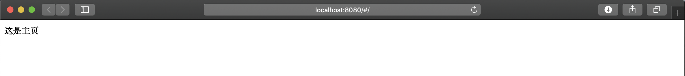

# todo

## Project setup
```
npm install
```

### Compiles and hot-reloads for development
```
npm run serve
```

### Compiles and minifies for production
```
npm run build
```

### Lints and fixes files
```
npm run lint
```

### Customize configuration
See [Configuration Reference](https://cli.vuejs.org/config/).


# 配置Vue-Router

1. 安装vue-router到项目中
```shell script
npm i vue-router
```

2. 在src中建立router文件夹，并在router文件夹中添加以下内容
```js
import Vue from 'vue'
import Router from 'vue-router'  // 导入vue-router

Vue.use(Router)

// 导出路由
export default new Router({
  routes: [
    {
      path: '/',
      name: 'home',
      component: () => import('@/pages/home/Home') // 异步加载组件
    }
  ]
})

```

3. 在main.js 中加载router

```js
import router from './router'

new Vue({
  render: h => h(App),
  router,
}).$mount('#app')
```
4. 在src目录中建立pages/home文件夹，并在文件夹中建立Home.vue，写入以下内容
```vue
<template>
  <div>
    这是主页
  </div>
</template>

<script>
  export default {
    name: 'Home'
  }
</script>

<style scoped>

</style>
```

启动项目，访问 http://localhost:8080/ 地址就可以看到如下内容：



# Element-UI载入
安装参考文档：https://element.eleme.cn/#/zh-CN/component/installation
简单使用参考文档：https://element.eleme.cn/#/zh-CN/component/quickstart

全局安装element-ui组件：
```shell script
npm i element-ui -S
```

在App.vue文件中加入以下内容：
```js
import ElementUI from 'element-ui'
import 'element-ui/lib/theme-chalk/index.css'

Vue.use(ElementUI)
```


Vuex中存储的数据如果刷新当前页面的话，则会被重新加载，之前存储的数据都会消失。这里的页面刷新指的是调用 `location.reload()` 方法

